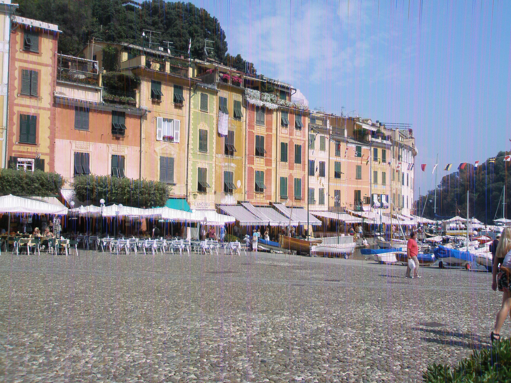
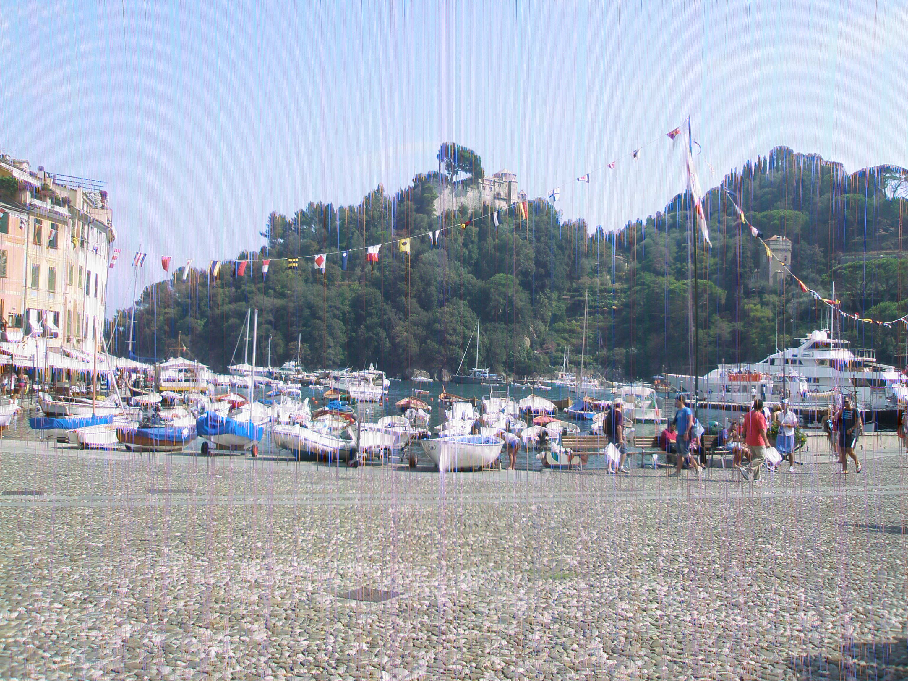

# denoise
This is a work in progress hobby project I started due to a malfunctioning camera. I had one of my nicest holidays in Italy only to discover later that all my images had strange vertical line artifacts on them. This project aims to fix my images. I opted for implementing a denoising autoencoder with pytorch.

Example images: 

